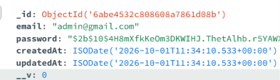

# The Manthan School — Web & Admin Portal

A full-stack school management web application built with **Next.js (App Router)**, **TypeScript**, and **Tailwind CSS**, connected to an Express REST API backend.

- **Live URL**: [https://salimadtric.netlify.app/](https://salimadtric.netlify.app/)

---

## 1. Installation

### Prerequisites
- **Node.js**: v18.17.0 or higher
- **npm**, **yarn**, or **pnpm**

### Steps

1. **Clone the repository:**
   ```bash
   git clone <repository-url>
   cd adtric_task
   ```

2. **Install dependencies:**
   ```bash
   npm install
   ```

3. **Configure Environment Variables:**
   Create a `.env` file in the root directory:
   ```env
   NEXT_PUBLIC_API_URL=https://adtric-assignment.onrender.com
   ```

4. **Run the Development Server:**
   ```bash
   npm run dev
   ```
   Open [http://localhost:3000](http://localhost:3000) in your browser.

5. **Build for Production (Optional):**
   ```bash
   npm run build
   npm start
   ```

---

## 2. Admin



The Admin portal (`/admin`) provides full administrative control over school communications, content, and prospective student admissions.

- **Authentication & Session Security**:
  - Secure credential-based login (`/admin/login`).
  - Token-based session management stored in HTTP cookies (`auth_token`).
  - Protected admin routes with route guard redirects for unauthenticated sessions.
  - One-click logout confirmation modal clearing active sessions.

- **Dashboard Overview (`/admin`)**:
  - Centralized overview showing key summary metrics.
  - Quick action links and navigation to manage enquiries and events.

- **News & Events Management (`/admin/news-events`)**:
  - **Listing & Filters**: View all news and events with category filtering (`All`, `News`, `Events`), live keyword search, and pagination.
  - **Status Toggle**: Toggle items between `Active` and `Inactive` visibility directly.
  - **Create News/Event (`/admin/news-events/add`)**: Create new articles with title, category, event date, description/content, status, and image upload with real-time preview and Zod form validation.
  - **Edit News/Event (`/admin/news-events/[id]`)**: Update existing content, modify details, and replace or retain existing images.
  - **Delete News/Event**: Delete records with confirmation modal prompts to prevent accidental removal.

- **Admission Enquiries (`/admin/enquiries`)**:
  - View all student admission enquiries submitted through the public website.
  - Table displaying student name, parent/guardian name, email, phone number, grade applied for, message, and submission date.
  - Search, filter, and pagination support for managing incoming inquiries.
  - Delete inquiry records with confirmation dialogs.

---

## 3. Web

The public-facing website (`/web`) represents The Manthan School, offering information to parents, students, and visitors.

- **Home Page (`/web`)**:
  - **Hero Section**: School branding, mission statement, and quick "Enquire Now" call-to-actions.
  - **About & Academics**: Information about campus culture, educational philosophy, and facilities.
  - **Featured Announcements**: Dynamic preview of recent school news and upcoming events.
  - **Admission Enquiry Form**: Interactive modal/form allowing prospective parents to submit inquiries (parent name, student name, email, phone number, class/grade, message) with instant client-side validation and toast notifications.

- **News & Events Listing (`/web/news-events`)**:
  - Comprehensive listing of school announcements, achievements, and upcoming events.
  - Category filter tabs (`All`, `News`, `Events`) for focused browsing.
  - Title and keyword search bar for finding specific announcements.
  - Pagination controls for navigating through articles.
  - Responsive visual cards displaying publication dates, category badges, image thumbnails, and excerpt previews.

- **News & Events Detail Page (`/web/news-events/[slug]`)**:
  - Dedicated page for reading full articles and event details.
  - High-resolution header image, published date, category tag, and full rich text description.
  - "Related News & Events" section showcasing other relevant articles.
  - Back navigation button returning directly to the listing.

- **Global Navigation & Layout**:
  - Responsive header with school navigation menu and sticky enquiry button.
  - Informative footer with contact details, address, quick links, and social channels.
